# Genshin Battle

> Proyecto de clase — Programación Orientada a Objetos y Arrays Bidimensionales  
> Traslado de simulación de batalla en Java (terminal) a JavaScript con interfaz web.

🌐 **[Jugar Ahora](https://haru-jzmprg.github.io/proyecto-juego-js/)**

---

## Introducción

Este proyecto nació como una simulación de batalla por turnos desarrollada en **Java para la terminal**, como ejercicio de POO y arrays bidimensionales. La lógica se estructuró en clases independientes (`Personaje`, `PersonajeMalo`, `PersonajeBueno`, `TableroDeJuego`, `Combate`, `Vision`, `Arma`, `Posicion`) que se comunicaban entre sí siguiendo los principios de herencia, encapsulamiento y polimorfismo.

Para la landing page del proyecto, el código Java fue trasladado íntegramente a **JavaScript**, manteniendo la misma arquitectura de clases y lógica de juego, y añadiendo una interfaz visual con **HTML5 Canvas**, **CSS** y una estética inspirada en *Genshin Impact*. El tablero que antes se pintaba carácter a carácter en consola ahora se renderiza frame a frame sobre un canvas adaptativo.

---

## Mecánicas del juego

### El tablero
- Cuadrícula de **40 filas × 60 columnas**.
- Rodeado de un borde infranqueable con sprites visuales por región.
- Se generan obstáculos en posiciones aleatorias del interior.
- El tamaño visual de las celdas es **adaptativo a la pantalla** (escritorio y móvil).

### Los personajes
Hay dos facciones: **malos** (Facción Oscura) y **buenos** (Facción de la Luz). Cada personaje recibe al crearse:
- Una **Visión elemental** aleatoria: `Pyro`, `Hydro`, `Electro`, `Dendro`, `Anemo`, `Geo` o `Cryo`.
- Un **Arma** aleatoria: `Espada`, `Mandoble`, `Lanza`, `Arco` o `Catalizador`.

### Comportamiento de los malos
1. **Patrulla**: se mueven en línea recta rebotando al chocar con obstáculos o bordes.
2. **Detección**: si un bueno entra en un radio de 6 casillas, el malo lo fija como objetivo.
3. **Persecución**: cuando tiene objetivo, se mueve **2 pasos por turno** hacia él (doble velocidad).
4. **Caza final**: cuando quedan menos de 3 buenos, todos los malos van a por el más cercano sin importar la distancia.
5. **Combate**: si el objetivo está adyacente, resuelve el combate.

### Comportamiento de los buenos
1. **Huida**: si un malo entra en su radio de peligro (5 casillas), el bueno huye en la dirección más alejada posible.
2. **Patrulla**: cuando quedan muy pocos malos (≤5), el bueno se anima y empieza a moverse.

### Sistema de combate
Cuando un malo intenta moverse a la casilla de un bueno, se resuelve un combate:

| Situación | Probabilidad de ganar el atacante |
|---|---|
| Ventaja de Visión elemental | 60% |
| Desventaja de Visión elemental | 40% |
| Ventaja de Arma (sin ventaja elemental) | 60% |
| Desventaja de Arma (sin ventaja elemental) | 40% |
| Sin ventaja de ningún tipo | 50% |

### Cadena elemental (quién gana a quién)
```
Pyro → Cryo → Geo → Anemo → Dendro → Electro → Hydro → Pyro
```

### Cadena de armas
```
Espada → Catalizador → Arco → Lanza → Mandoble → Espada
```

---

## Regiones

El juego incluye **7 regiones de Teyvat**, cada una con tema visual propio (colores, bordes, partículas, ambiente animado):

| Región | Elemento | Tema |
|---|---|---|
| Mondstadt | Anemo | Campo verde, cielo azul |
| Liyue | Geo | Atardecer dorado |
| Inazuma | Electro | Noche morada, madera oscura |
| Sumeru | Dendro | Selva verde vibrante |
| Fontaine | Hydro | Azul acuático, cáusticas |
| Natlan | Pyro | Noche volcánica, lava |
| Snezhnaya | Cryo | Noche ártica, aurora boreal |

---

## Controles

| Control | Función |
|---|---|
| **Iniciar Batalla** | Genera el tablero y lanza la simulación |
| **Pausar / Reanudar** | Congela o reanuda el bucle de juego |
| **Reiniciar** | Para la partida y vuelve al estado inicial |
| **Malos** | Cantidad de personajes malos (1–200) |
| **Buenos** | Cantidad de personajes buenos (1–200) |
| **Obstác.** | Cantidad de obstáculos generados (0–500) |
| **Velocidad** | Slider 1×–10× que ajusta el delay entre turnos |

---

## Assets — Imágenes del juego

### Facción Oscura — Malos (Slimes)

| Slime | Archivo | Vista previa |
|---|---|---|
| Pyro | `assets/SLIME_PYRO.png` |  |
| Hydro | `assets/SLIME_HYDRO.png` |  |
| Electro | `assets/SLIME_ELECTRO.png` |  |
| Dendro | `assets/SLIME_DENDRO.png` |  |
| Anemo | `assets/SLIME_ANEMO.png` |  |
| Geo | `assets/SLIME_GEO.png` |  |
| Cryo | `assets/SLIME_CRYO.png` |  |

### Facción de la Luz — Buenos

| Elemento | Archivo | Vista previa |
|---|---|---|
| Pyro | `assets/PYRO.png` |  |
| Hydro | `assets/HYDRO.png` |  |
| Electro | `assets/ELECTRO.png` |  |
| Dendro | `assets/DENDRO.png` |  |
| Anemo | `assets/ANEMO.png` |  |
| Geo | `assets/GEO.png` |  |
| Cryo | `assets/CRYO.png` |  |

### Obstáculo

| Nombre | Archivo | Vista previa |
|---|---|---|
| Torre Hilichurl | `assets/TORRE.png` | 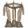 |

### Mondstadt

| Pieza | Archivo | Vista previa |
|---|---|---|
| Horizontal | `mondstadt_horizontal.png` |  |
| Vertical | `mondstadt_vertical.png` | 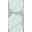 |
| Esquina sup. izq. | `mondstadt_esquina_sup_izq.png` |  |
| Esquina sup. der. | `mondstadt_esquina_sup_der.png` |  |
| Esquina inf. izq. | `mondstadt_esquina_inf_izq.png` |  |
| Esquina inf. der. | `mondstadt_esquina_inf_der.png` |  |

### Liyue

| Pieza | Archivo | Vista previa |
|---|---|---|
| Horizontal | `liyue_horizontal.png` |  |
| Vertical | `liyue_vertical.png` | 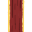 |
| Esquina sup. izq. | `liyue_esquina_sup_izq.png` |  |
| Esquina sup. der. | `liyue_esquina_sup_der.png` |  |
| Esquina inf. izq. | `liyue_esquina_inf_izq.png` |  |
| Esquina inf. der. | `liyue_esquina_inf_der.png` |  |

### Inazuma

| Pieza | Archivo | Vista previa |
|---|---|---|
| Horizontal | `inazuma_horizontal.png` |  |
| Vertical | `inazuma_vertical.png` | 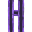 |
| Esquina sup. izq. | `inazuma_esquina_sup_izq.png` |  |
| Esquina sup. der. | `inazuma_esquina_sup_der.png` |  |
| Esquina inf. izq. | `inazuma_esquina_inf_izq.png` | 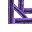 |
| Esquina inf. der. | `inazuma_esquina_inf_der.png` | 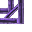 |

### Sumeru

| Pieza | Archivo | Vista previa |
|---|---|---|
| Horizontal | `sumeru_horizontal.png` |  |
| Vertical | `sumeru_vertical.png` | 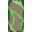 |
| Esquina sup. izq. | `sumeru_esquina_sup_izq.png` | 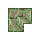 |
| Esquina sup. der. | `sumeru_esquina_sup_der.png` | 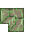 |
| Esquina inf. izq. | `sumeru_esquina_inf_izq.png` | 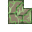 |
| Esquina inf. der. | `sumeru_esquina_inf_der.png` | 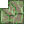 |

### Fontaine

| Pieza | Archivo | Vista previa |
|---|---|---|
| Horizontal | `fontaine_horizontal.png` |  |
| Vertical | `fontaine_vertical.png` | 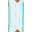 |
| Esquina sup. izq. | `fontaine_esquina_sup_izq.png` |  |
| Esquina sup. der. | `fontaine_esquina_sup_der.png` |  |
| Esquina inf. izq. | `fontaine_esquina_inf_izq.png` |  |
| Esquina inf. der. | `fontaine_esquina_inf_der.png` |  |

### Natlan

| Pieza | Archivo | Vista previa |
|---|---|---|
| Horizontal | `natlan_horizontal.png` | 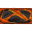 |
| Vertical | `natlan_vertical.png` | 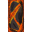 |
| Esquina sup. izq. | `natlan_esquina_sup_izq.png` | 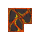 |
| Esquina sup. der. | `natlan_esquina_sup_der.png` | 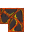 |
| Esquina inf. izq. | `natlan_esquina_inf_izq.png` | 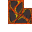 |
| Esquina inf. der. | `natlan_esquina_inf_der.png` | 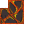 |

### Snezhnaya

| Pieza | Archivo | Vista previa |
|---|---|---|
| Horizontal sup. | `snezhnaya_horizontal_sup.png` |  |
| Horizontal inf. | `snezhnaya_horizontal_inf.png` |  |
| Vertical der. | `snezhnaya_vertical_der.png` |  |
| Vertical izq. | `snezhnaya_vertical_izq.png` |  |
| Esquina sup. izq. | `snezhnaya_esquina_sup_izq.png` |  |
| Esquina sup. der. | `snezhnaya_esquina_sup_der.png` |  |
| Esquina inf. izq. | `snezhnaya_esquina_inf_izq.png` |  |
| Esquina inf. der. | `snezhnaya_esquina_inf_der.png` |  |

---

## 📁 Estructura del repositorio

```
/
├── README.md
│
├── bin/                        ← código fuente original en Java
│   └── game/
│       ├── App.js
│       ├── Arma.js
│       ├── Colores.js
│       ├── Combate.js
│       ├── Consola.js
│       ├── Personaje.js
│       ├── PersonajeBueno.js
│       ├── PersonajeMalo.js
│       ├── Posicion.js
│       ├── TableroDeJuego.js
│       └── Vision.js
│
└── docs/                       ← versión web (servida por GitHub Pages)
    ├── index.html
    ├── style.css
    ├── game.js
    └── assets/
        ├── SLIME_PYRO.png
        ├── SLIME_HYDRO.png
        ├── SLIME_ELECTRO.png
        ├── SLIME_DENDRO.png
        ├── SLIME_ANEMO.png
        ├── SLIME_GEO.png
        ├── SLIME_CRYO.png
        ├── PYRO.png
        ├── HYDRO.png
        ├── ELECTRO.png
        ├── DENDRO.png
        ├── ANEMO.png
        ├── GEO.png
        ├── CRYO.png
        ├── TORRE.png
        └── [bordes por región]
```

---

## 🛠️ Tecnologías

- **Java** — lógica original (POO, arrays 2D, enums, herencia)
- **JavaScript ES6+** — traslado de la lógica (clases, herencia, canvas API)
- **HTML5 Canvas** — renderizado del tablero frame a frame
- **CSS3** — interfaz visual con variables por región, responsive
- **GitHub Pages** — despliegue estático gratuito

---

